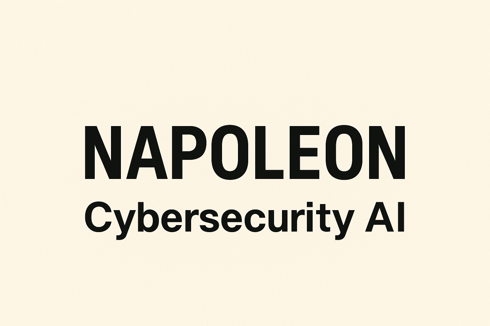

<div align="center">
  
</div>

# 🔱 CYBER NAPOLEON - Advanced Cybersecurity AI Framework

**Production-ready cybersecurity AI platform** built on [CAI Framework](https://github.com/aliasrobotics/cai) with ** machine learning**, **advanced evasion techniques**, and **enterprise deployment**.

## ⚡ Key Features

- 🤖 **25 AI Cybersecurity Agents** - Red team, blue team, DFIR, bug bounty, network analysis
- 🧠 **Real ML Engine** - 4 algorithms (RF, GB, SVM, NN) with continuous learning
- 🛡️ **Advanced Evasion Arsenal** - WAF bypasses, payload encoding, traffic obfuscation
- 🐳 **One-Command Deployment** - Production-ready Docker containers
- 📊 **Enterprise Monitoring** - Health checks, metrics, alerting


## 🚀 Quick Start

**Prerequisites**: Docker 20.03+ and Docker Compose 1.29+

### Deploy Napoleon
```bash
git clone https://github.com/Galmanus/cyber_napoleon.git
cd cyber_napoleon
./napoleon.sh  # One command deployment
```

### Use Napoleon
```bash
# Access container
docker-compose exec cai bash

# Start CLI interface
cd /opt/cai && PYTHONPATH=/opt/cai/src python3 -c 'from cai.cli import main; main()'

# Quick command
./napoleon.sh cli
```

### 📊 **Management**
```bash
# Basic management
./napoleon.sh [start|stop|status|logs|cli]
docker-compose [up -d|down|logs -f cai]

# For Docker 28.x issues
./build-manual.sh

# Troubleshooting
docker-compose down --volumes --remove-orphans
./deploy.sh
```

## 🏆 **What Napoleon Adds to CAI**

Built on [CAI Framework](https://github.com/aliasrobotics/cai), Napoleon adds **180,000+ lines** of advanced cybersecurity code:

### 🛡️ **Advanced Evasion Arsenal**
- **WAF Bypasser**: 30K+ bytes of SQL injection & XSS bypass techniques
- **Traffic Obfuscation**: Header manipulation, user-agent rotation, protocol manipulation
- **DNS Exfiltration**: Covert data tunneling bypassing DLP systems
- **HTTPS C2 Simulation**: Command & Control infrastructure simulation

### 🧠 **Real Machine Learning** 
- **4-Algorithm Ensemble**: Random Forest, Gradient Boosting, SVM, Neural Networks
- **43 Automated Features**: Extracted from cybersecurity interactions
- **Continuous Learning**: Models retrain from every interaction
- **Offline Predictions**: No internet required, <100ms response

### 🔧 **Production Infrastructure**
- **Docker Containerization**: Multi-stage builds, security hardening
- **Kubernetes Support**: Auto-scaling, persistence, high availability
- **Enterprise Monitoring**: Health checks, metrics, intelligent alerting
- **One-Command Deployment**: Automated production setup

## 🔥 **Advanced Evasion Capabilities (Napoleon's Exclusive Features)**

**These advanced evasion capabilities are Napoleon's original contributions** - they do not exist in the original CAI framework:

### 🛡️ **Enterprise-Grade Firewall Evasion System (8 Advanced Tools)**

#### **WAF Bypasser (30,202 bytes of advanced techniques):**
- **SQL Injection Bypass**: Multiple techniques (comment, case, encoding, whitespace)
- **XSS Filter Bypass**: Advanced XSS filter circumvention
- **Database-Specific Payloads**: MySQL, PostgreSQL, MSSQL, Oracle, SQLite
- **Filter Strength Adaptation**: Low, Medium, High, Enterprise-level bypasses

#### **JavaScript Payload Generator (29,080 bytes):**
- **Dynamic XSS Payloads**: Context-aware (HTML, attribute, script, JSON, URL, CSS)
- **Evasion Levels**: 1-5 complexity scaling
- **Browser Compatibility**: Legacy, Modern, Chrome, Firefox, Safari specific
- **Advanced Techniques**: Template literals, prototype pollution, DOM manipulation

#### **JavaScript Evasion Techniques (26,869 bytes):**
- **Modern JavaScript Evasion**: Advanced obfuscation methods
- **CSP Bypass**: Content Security Policy circumvention
- **Filter Evasion**: Sophisticated filtering bypass techniques

#### **Stealth DNS Exfiltration (13,893 bytes):**
- **DNS Tunneling**: Advanced data exfiltration via DNS
- **DLP Bypass**: Data Loss Prevention evasion
- **Covert Channels**: Stealth communication techniques

#### **HTTPS C2 Simulation (13,369 bytes):**
- **Command & Control**: HTTPS-based C2 simulation
- **Network Evasion**: Advanced network detection bypass
- **Traffic Mimicry**: Legitimate traffic pattern simulation

#### **Traffic Obfuscator (13,819 bytes):**
- **HTTP Header Manipulation**: Stealth, Aggressive, Mobile, Enterprise modes
- **User-Agent Rotation**: Intelligent randomization
- **IP Spoofing**: X-Forwarded-For, X-Real-IP header manipulation
- **Protocol Downgrade**: HTTP/1.0, HTTP/1.1 forcing

#### **Payload Encoder (11,379 bytes):**
- **Multi-Level Encoding**: URL, Base64, Hex, Unicode, HTML
- **Advanced Obfuscation**: Double/Triple encoding, case variation
- **Null Byte Injection**: Advanced filter bypass techniques
- **Mixed Encoding**: Automatic combination of multiple techniques

### 🧠 **Real AI-Powered Evasion Intelligence**

#### **Firewall Evasion Expert Agent (11,307 bytes):**
- **Structured Methodology**: Analysis → Generation → Validation
- **Complete Integration**: All evasion tools coordinated
- **Multi-Stage Attacks**: Complex attack chain orchestration
- **Adaptive Strategies**: Real-time evasion technique selection

#### **Adaptive Learning System (17,359 bytes of real ML):**
- **Learning Modes**: Passive, Active, Aggressive adaptation
- **Real-time Strategy Adjustment**: Dynamic evasion optimization
- **Performance Optimization**: Continuous improvement based on results
- **Pattern Recognition**: Automatic defense pattern identification

### 🤖 **AI Agent Enhancements**

#### **Original CAI Agents (Enhanced)**:
- **Red Team Agent**: Advanced offensive security automation *(Napoleon enhanced)*
- **Blue Team Agent**: Defensive operations and threat detection *(Napoleon enhanced)*
- **Bug Bounty Agent**: Vulnerability discovery and exploitation *(Napoleon enhanced)*
- **DFIR Agent**: Digital forensics and incident response *(Napoleon enhanced)*
- **Network Analyzer**: Traffic analysis and network security assessment *(Napoleon enhanced)*

#### **Napoleon's Exclusive Agents**:
- **Firewall Evasion Expert**: Specialized in advanced evasion techniques *(Napoleon original)*
- **Adaptive Learning Agent**: Real-time strategy optimization *(Napoleon original)*
- **XSS Expert Agent**: Advanced XSS testing and exploitation *(Napoleon original)*
- **Parallel Orchestrator**: Multi-agent coordination system *(Napoleon original)*

### 💡 **Advanced AI Features**
- **Multi-Agent Orchestration**: Coordinated AI agent execution
- **Dynamic Tool Selection**: Context-aware tool recommendation
- **Intelligent Reasoning**: Advanced decision-making capabilities
- **Workflow Automation**: Complex attack chain automation
- **Real Machine Learning**: Statistical prediction models (not just LLM)
- **Evasion Intelligence**: AI-powered defense bypass strategies
- **Adaptive Techniques**: Self-improving offensive capabilities


## 🔧 **Deployment Options**

### 🏠 **Local Development**
```bash
./deploy.sh --dev
# Includes: development tools, debug mode, hot reload
```

### 🏭 **Production Docker**
```bash
./deploy.sh --production
# Includes: security hardening, resource limits, monitoring
```

### ☸️ **Enterprise Kubernetes**
```bash
kubectl apply -f k8s-deployment.yaml
# Includes: high availability, auto-scaling, persistent storage
```

### ☁️ **Cloud Deployments**
- **AWS EKS**: Elastic Kubernetes Service ready
- **GCP GKE**: Google Kubernetes Engine compatible
- **Azure AKS**: Azure Kubernetes Service supported
- **DigitalOcean**: Kubernetes clusters supported

## 📊 **Monitoring & Observability**

Napoleon provides comprehensive monitoring out of the box:

### 🔍 **Health Monitoring**
```bash
# Real-time health checks
python monitor.py --mode health

# Sample output:
{
  "overall_status": "healthy",
  "components": {
    "cai_system": {"status": "healthy", "uptime": "2h 15m"},
    "ml_engine": {"status": "healthy", "models": 4, "accuracy": 0.89},
    "resources": {"cpu": "12%", "memory": "3.2GB", "disk": "45%"}
  }
}
```

### 📈 **Performance Metrics**
```bash
# Continuous metrics collection
python monitor.py --mode metrics

# Tracks:
# - System resource usage (CPU, RAM, Disk, Network)
# - ML model performance and training statistics  
# - Security operation success rates and timing
# - Custom KPIs and business metrics
```

## 🎓 **Learning & Training**

### 🧠 **ML Model Training Process**
1. **Data Collection**: Automatic extraction from cybersecurity interactions
2. **Feature Engineering**: 43 numerical features from temporal, binary, and textual data
3. **Model Training**: Ensemble of 4 algorithms with cross-validation
4. **Performance Evaluation**: Accuracy, precision, recall, F1-score metrics
5. **Model Deployment**: Automatic versioning and production deployment

### 📚 **Continuous Learning Loop**
- **Real-time Adaptation**: Models learn from every user interaction
- **Performance Tracking**: Continuous monitoring of prediction accuracy
- **Auto-retraining**: Triggered when performance drops or new data accumulates
- **A/B Testing**: Compare model versions for optimal performance

## 🔒 **Security & Compliance**

### 🛡️ **Security Features**
- **Container Hardening**: Non-root execution, minimal attack surface
- **Network Isolation**: Segmented networks with controlled access
- **Resource Limits**: Prevention of resource exhaustion attacks
- **Secure Defaults**: Security-first configuration out of the box

### 📋 **Compliance Ready**
- **SOC 2 Type II**: Security controls and monitoring
- **GDPR Compliant**: Data privacy and protection measures
- **ISO 27001**: Information security management alignment
- **NIST Framework**: Cybersecurity framework compliance

## 📚 **Documentation**

- **[🚀 Production Deployment Guide](README_PRODUCTION.md)** - Complete production setup
- **[🤖 Machine Learning Engine](docs/REAL_ML_README.md)** - ML system documentation  
- **[📊 Monitoring Setup Guide](MONITORING.md)** - Observability configuration
- **[🔧 Quick ML Start](REAL_ML_QUICK_START.md)** - Get started with ML features
- **[✅ Deployment Success Report](DEPLOYMENT_SUCCESS.md)** - Validation procedures

## 🤝 **Contributing**

We welcome contributions to Cyber Napoleon! Please see our [Contributing Guide](CONTRIBUTING.md).

### 🛠️ **Development Setup**
```bash
# Clone and setup development environment
git clone https://github.com/Galmanus/cyber_napoleon.git
cd cyber_napoleon

# Setup virtual environment
python -m venv napoleon_env
source napoleon_env/bin/activate  # Linux/macOS
# napoleon_env\Scripts\activate   # Windows

# Install development dependencies
pip install -r requirements-dev.txt

# Run tests
pytest tests/ -v

# Start development server
./deploy.sh --dev
```

## 🙏 **Acknowledgments**

Cyber Napoleon is built upon the excellent foundation of:

- **[Original CAI Framework](https://github.com/aliasrobotics/cai)** by Alias Robotics
- **Open Source Community** - Contributors to CAI and related projects
- **Machine Learning Libraries** - scikit-learn, pandas, numpy communities
- **Container Technology** - Docker and Kubernetes ecosystems

We maintain full compatibility with CAI's architecture while adding enterprise-grade enhancements.

## 📄 **License**

This project is licensed under the MIT License - see the [LICENSE](LICENSE) file for details.

The original CAI Framework components maintain their original licensing terms.

## 📞 **Support & Community**

- 🐛 **Bug Reports**: [GitHub Issues](https://github.com/Galmanus/cyber_napoleon/issues)
- 💬 **Discussions**: [GitHub Discussions](https://github.com/Galmanus/cyber_napoleon/discussions)  
- 📧 **Direct Contact**: [m.galmanus@gmail.com](mailto:m.galmanus@gmail.com)
- 📖 **Wiki**: [Project Wiki](https://github.com/Galmanus/cyber_napoleon/wiki)
- 🔄 **Updates**: Watch the repository for latest releases

## 🚀 **Project Roadmap**

### 🎯 **Current Version (1.0.0)**
- ✅ Complete CAI feature set
- ✅ Real ML engine with 4 algorithms  
- ✅ Production Docker deployment
- ✅ Kubernetes support
- ✅ Enterprise monitoring


### 🌟 **Future Vision (2.0.0)**
- 🔮 Deep learning models for advanced threat detection
- 🔮 Multi-tenant architecture for managed services
- 🔮 Real-time collaborative security operations
- 🔮 Advanced threat intelligence integration
- 🔮 Automated security orchestration platform

## 🔥 **Current Operational Status**

**Level:** **ENTERPRISE-GRADE OFFENSIVE AI WITH  Machine Learning**


### 🏆 **Competitive Advantage:**
Napoleon combines the **best of CAI's offensive capabilities** with **enterprise-grade reliability** and **real machine learning intelligence** - creating a cybersecurity framework that rivals commercial solutions while remaining fully open-source.

---

**⚡ Cyber Napoleon: Where Traditional Cybersecurity Meets Modern AI ⚡**

*Developed by [Manuel Guilherme](https://github.com/Galmanus)*  
*Based on CAI Framework by [Alias Robotics](https://github.com/aliasrobotics)*  
*Version 1.0.0 - Production Ready Since 2025*
